# Section D — Claude-Design Revamp

> When this plan is approved, write the same content to
> `docs/plans/2026-05-10-section-d-claude-design-revamp.md` and use it as
> the working document during implementation.

## Context

A revised, finished design for Section D (D.1–D.5) has been mocked up in
`claude-design-section-d/` (vanilla React-via-Babel + plain CSS). It
changes step counts, layouts, copy, animations, and the exact pixel
geometry of every slide. Our current `src/slides/foundation-core/*`
implements an earlier spec — different step tables, a 5-card-on-canvas
D.2, a morphing-tile D.3, an inline `LadderRise` D.4, and Tailwind-driven
positioning rather than the `.fig-label`/absolute-stage-coords system.

Goal: make our implementation match the new design EXACTLY in content,
structure, layout, and motion while keeping the existing project
structure (folders/files in `src/`), the TS + Tailwind + Framer-Motion
stack, the deck shell (`src/deck/*`), the FigLabel/highlight components
in `src/components/*`, and the Section E precedent (`globals.css`
deck-chrome, `Reveal`/`CopperRule` primitives, `LucideIcon` registry).

The deck shell already has every capability the design source needs
(`useDeck.advance/retreat/nextStep/prevStep/resetStep/resetDeck`, the
hover-revealed NavBar, click-to-advance with `data-no-advance` carve-outs,
the 1280×720 letterbox stage, the keyboard map). No deck-shell changes
are required.

## Source-of-truth map

```
claude-design-section-d/                  →  src/...
  index.html                                 (no port — fonts/CDN already in globals.css)
  css/styles.css                             src/styles/globals.css            (port the d3-anim/d3-bpm/d3-rpa rules + .fig-label nowrap/right edges)
  jsx/shell.jsx                              already covered by src/deck/* + src/components/FigLabel + src/slides/foundation-core-section-e/components/{Reveal,LucideIcon}
  jsx/data.jsx                               src/slides/foundation-core/content.ts   (rewrite to match data.jsx schema verbatim)
  jsx/slides-d.jsx (D1–D5)                   src/slides/foundation-core/d1..d5-*.tsx (rewrite slide bodies; new component set)
  assets/d5-bridge.jpg                       assets/heroes/d5-bridge.jpg              (already present, identical name)
```

## Architecture diagram

```mermaid
flowchart TB
  subgraph Shell["src/deck — unchanged"]
    Slide[Slide.tsx · letterbox · click-advance · NavBar mount]
    Ctx[DeckContext.tsx · stepIndex · advance/retreat]
  end

  subgraph Shared["src/components + section-e shared bits — light edits only"]
    Fig[FigLabel.tsx · use .fig-label class · kind copper-200, optional title copper-300]
    HL[highlight.tsx + KeywordHighlight.tsx · unchanged]
    Lu[section-e/components/LucideIcon.tsx · +Workflow/Bot/Sparkles/Target]
    Rv[section-e/components/Reveal.tsx · Reveal + CopperRule reused]
    CSS[styles/globals.css · +d3-anim, +d3-bpm-*, +d3-rpa-*, .fig-label right/nowrap]
  end

  subgraph Content["src/slides/foundation-core — rewritten"]
    C[content.ts · D1..D5 verbatim from data.jsx]
    D1[d1-the-trap.tsx · 3 steps · stat shrinks → mechanism+bars+AutomationLoop → Rx]
    D2[d2-the-convergence.tsx · 3 steps · left list + right detail OR right network]
    D3[d3-one-process-four-levels.tsx · 5 steps · 4 columns w/ looping motion glyphs]
    D4[d4-decision-pattern.tsx · 6 steps · ladder spine + 5 terminal cards]
    D5[d5-bridge-to-e.tsx · 3 steps · hero photo + horizon glow + 3 lines]
  end

  subgraph Local["src/slides/foundation-core/components — replaced set"]
    AmpBar[AmpBar.tsx]
    AutoLoop[AutomationLoop.tsx]
    D2List[D2ListCard.tsx]
    D2Detail[D2DetailPanel.tsx]
    D2Net[D2Network.tsx + D2Satellite + d2Seg]
    D3Anims[D3Anims.tsx · BPM/RPA/IPA/AGENTIC SVGs]
    D3Card[D3LevelCard.tsx]
    D4Ladder[D4Ladder.tsx · spine + 5 rungs]
    D4Term[D4TerminalCard.tsx]
  end

  Slide --> D1 & D2 & D3 & D4 & D5
  D1 --> AmpBar & AutoLoop
  D2 --> D2List & D2Detail & D2Net
  D3 --> D3Card & D3Anims
  D4 --> D4Ladder & D4Term
  C --> D1 & D2 & D3 & D4 & D5
  Fig --> D1 & D2 & D3 & D4 & D5
  HL --> D1 & D2 & D3 & D4 & D5
  Rv --> D1 & D2 & D3 & D4 & D5
  Lu --> D2 & D3
  CSS --> D3Anims & Fig
```



## What's new vs. existing — step tables

| Slide | Current steps | New steps | Notes |
|------:|:-------------:|:---------:|:-----|
| D.1   | 4             | **3**     | beat1 stat / beat2 mechanism+bars+AutomationLoop / beat3 Rx |
| D.2   | 5             | **3**     | left list always-on / step1 = network reveal / step2 = summary |
| D.3   | 5             | **5**     | step 0..3 walks BPM→RPA→IPA→AGENTIC; step 4 = capstone + free hover |
| D.4   | 5             | **6**     | step 0..4 reveal rungs 1..5; step 5 reveals footer |
| D.5   | 3             | **3**     | beat1 / beat2 / bridge + horizon glow |

`canonicalPose` for each: `steps - 1` (D.1=2, D.2=2, D.3=4, D.4=5, D.5=2).

## File-by-file changes

### 1. Content — `src/slides/foundation-core/content.ts`

Rewrite to match `claude-design-section-d/jsx/data.jsx` exactly. Field
naming follows the design-source schema (same convention used for
Section E's `content.tsx`):

- `d1Content`: `beat1 {statValue, statSuffix, subLine, subLineKw, caption}`,
  `beat2 {mechanism, mechanismKw, manualLabel, manualValue, machineLabel,
  machineValue, caption, captionKw}`, `beat3 {prescription, prescriptionKw,
  sub, subKw}`.
- `d2Content`: `headline`, `headlineKw`, `cards[] {key, title, subName,
  icon, tagline, taglineKw, bullets[], copper, analogy}`, `summary`,
  `summaryKw`. Five cards: bpm/rpa/ai/ipa/agentic.
- `d3Content`: `headline`, `headlineKw`, `sub`, `subKw`, `levels[] {key,
  label, copper, ask, askKw, bullets[]{text,kw}, outcome, outcomeKw}`,
  `capstone`, `capstoneKw`. Four levels: bpm/rpa/ipa/agentic.
- `d4Content`: `headline`, `headlineKw`, `questions[] {num, q, kw, yes,
  no, yesTerminal?, noTerminal?}`, `terminals { STOP|BPM|RPA|IPA|AGENTIC
  → {sub, copper} }`, `footer`, `footerKw`.
- `d5Content`: `beat1 {text, kw}`, `beat2 {text, kw}`, `bridge {text,
  kw}`, `attr`.

Drop the old fields (`subLineKeywords`, `convergedBullets`,
`hoverAnalogy`, `aiFeederBullets`, `resultCapstone`, `ladder`, etc.) —
nothing else reads them once the slides are rewritten.

### 2. Shared component edits

- **`src/components/FigLabel.tsx`** — re-render using the design-source
  markup so the kind matches `.fig-label` exactly:
  ```tsx
  <div className="fig-label">
    — FIG. {section}.{num}<span className="dot">·</span>
    <span style={{ color: 'var(--copper-200)' }}>{label}</span>
  </div>
  ```
  Drop the inline Tailwind absolute classes. Styling lives in
  `globals.css` `.fig-label`. The `section/num/label` API is preserved
  so I/J/K and Section E callers don't change.
- **`src/styles/globals.css`** — three additive blocks (port verbatim
  from `claude-design-section-d/css/styles.css`):
  1. `.fig-label` — add `right: 48px; white-space: nowrap; overflow:
     hidden; text-overflow: ellipsis;` to the existing rule.
  2. `.d3-anim`, `.d3-anim-caption` (uniform-shell + bottom-anchored
     caption).
  3. `.d3-bpm-row`, `.d3-bpm-block` and `@keyframes d3-bpm-top` /
     `d3-bpm-bottom`.
  4. `.d3-rpa-row`, `.d3-rpa-tag`, `.d3-rpa-track`, `.d3-rpa-fill` and
     `@keyframes d3-rpa-manual` / `d3-rpa-bot`.
- **`src/slides/foundation-core-section-e/components/LucideIcon.tsx`** —
  add `Workflow, Bot, Sparkles, Target` to the imports and the `ICONS`
  map. Section D slides import this same registry.

### 3. Slide rewrites — `src/slides/foundation-core/`

Each slide is rewritten to mirror its `slides-d.jsx` counterpart line-by-line
in layout, motion timings, copper accents, and content. Use the existing
`Reveal`, `CopperRule`, `KW` (= `highlight()`), `FigLabel`, `Headline`
(direct `.slide-headline-row` markup) primitives.

- **`d1-the-trap.tsx`** (3 steps) — `slides-d.jsx:143-257`.
  - Step 0: 73% counter + sub-line center-stage with caption.
  - Step ≥1: stat shrinks/migrates to header; left = mechanism h2 +
    `AmpBar` manual (1×, 1.5%) + `AmpBar` machine (1000×, 140%, tall) +
    italic caption; right = `<AutomationLoop />`.
  - Step ≥2: prescription block at the bottom with copper-800 top
    border.
  - canonicalPose `2`.
- **`d2-the-convergence.tsx`** (3 steps) — `slides-d.jsx:265-624`.
  - Always: left fixed 360px column with five `D2ListCard`s
    (bpm/rpa/ai/ipa/agentic), each hover-driving a `hovered` key.
  - Step 0: right = `D2DetailPanel` (chip → big subName headline →
    italic tagline → copper rule → bullets → analogy block); blank
    when nothing hovered.
  - Step ≥1: right swaps to `D2Network` with phase machine
    (200/800/1400/2200/3100 ms timers) revealing BPM, RPA, AI, IPA + 3
    feeder arrows, then AGENTIC + dashed arrow. Hovering a list card
    "heats" the matching network arrow.
  - Step ≥2: italic copper-200 summary band slot (height always
    reserved so the network does not shift).
  - canonicalPose `2`.
- **`d3-one-process-four-levels.tsx`** (5 steps) — `slides-d.jsx:626-910`.
  - 4-column grid (1fr each); each column = `D3LevelCard` with header
    (`Level N` + label), copper rule, ASK paragraph, DO bullet list,
    looping motion glyph (`D3BpmAnim` / `D3RpaAnim` / `D3IpaAnim` /
    `D3AgenticAnim`), bottom OUTCOME paragraph anchored by `flex:1`
    spacer.
  - Step `i` (i=0..3) focuses level `i`: highlight border, lift
    `translateY(-4px)`, copper inset shadow, full opacity; previous
    levels stay revealed; later levels at 0.35 opacity.
  - Step 4: capstone caption; hover unlocks (hover overrides focus).
  - canonicalPose `4`.
- **`d4-decision-pattern.tsx`** (6 steps) — `slides-d.jsx:921-1095`.
  - Left 700px column: header label "Decision tree", copper rule,
    vertical spine with `transform: scaleY((revealed-1)/4)` plus a
    5-row grid of question rungs (number circle, question, YES/NO
    branches). Steps 0..4 reveal rungs 1..5 in sequence with 110ms
    stagger.
  - Right column: header label "Outcomes", copper rule, 5-row grid of
    `D4TerminalCard`s (STOP/BPM/RPA/IPA/AGENTIC). Each terminal reveals
    on the question step that produces it; hover highlights both the
    terminal AND the matching YES/NO label on the ladder.
  - Step 5: bottom-left footer caption ("Skip a level…").
  - canonicalPose `5`.
- **`d5-bridge-to-e.tsx`** (3 steps) — `slides-d.jsx:1103-1162`.
  - Background: `<HeroPhoto src="/heroes/d5-bridge.jpg" alt=""
    vignetteSide="bottom-left" />` already covers the photo + dark
    overlay; on top of it add the design's two horizon-glow layers
    (radial + 1px copper line) that fade in on step 0/1.
  - Stack at `left:80, right:80, top:130, bottom:100`,
    `justify-content: flex-end`: beat1 (display 72px, neutral-50),
    beat2 (display 56px, copper-200), bridge row with 2px copper-500
    left border (italic 24px + mono attr).
  - canonicalPose `2`.

Slide registration in `index.ts` is unchanged (already exports the five
`d{N}Slide`s in order).

### 4. Local Section D components — `src/slides/foundation-core/components/`

Replace the existing set:

- DELETE: `AmplificationBar.tsx`, `ConvergenceCard.tsx`, `LevelCard.tsx`,
  `LadderRise.tsx`, `LadderQuestion.tsx`, `LadderTerminal.tsx`,
  `LadderLoopBack.tsx`, and the entire `glyphs/` folder
  (`BpmCompressionGlyph.tsx`, `RpaAccelerationGlyph.tsx`,
  `IpaSynthesisGlyph.tsx`, `AgenticInversionGlyph.tsx`).
- KEEP: `CountUp.tsx` (used by D.1 — the existing API is compatible;
  the design-source `on` gating isn't required because D.1 mounts the
  counter on step 0 unconditionally).
- ADD (each is a near-1:1 port of the corresponding helper in
  `slides-d.jsx`):
  - `AmpBar.tsx` — bar with label, value, animated width, optional `tall`
    + `accent` props; uses `transition: width 1.2s var(--ease)`.
  - `AutomationLoop.tsx` — 400×400 SVG with the rounded-rect track,
    `<animateMotion>`-driven slow tokens (top rail) and fast tokens
    (bottom rail), the EXEC block, and corner arrows. Pure SMIL — no
    Framer Motion needed.
  - `D2ListCard.tsx` — left-list compact card with icon + title +
    subName + tagline; hover writes via `onHover` callback.
  - `D2DetailPanel.tsx` — right detail block (chip / big headline /
    tagline / copper rule / bullets / analogy footer).
  - `D2Network.tsx` — fixed 760×320 coord space, internal `phase` state
    (0→5) driven by 5 timers; renders `<D2Satellite>` boxes and SVG
    `<line>` connectors with `<animateMotion>` pulses + an
    `agenticHot`/`feederHot` highlight rule from `hovered`. Includes
    the `D2_NET_W`, `D2_NET_H`, `D2_SAT_W`, `D2_SAT_H` constants and
    `d2Seg(a, b)` helper from the source.
  - `D3LevelCard.tsx` — receives `level`, `index`, `focused`, `hovered`,
    `revealed`; renders the column shell + ASK/DO/OUTCOME + slot for
    the motion glyph child.
  - `D3Anims.tsx` — exports the four glyph components (BPM block grid
    via `.d3-bpm-row`/`.d3-bpm-block`; RPA dual-fill via
    `.d3-rpa-track`/`.d3-rpa-fill`; IPA 4-source SVG with
    `<animateMotion>` particles converging on the insight node;
    AGENTIC pulse rings + orbital-satellite group). Each renders into
    a `.d3-anim` shell with a bottom-anchored caption.
  - `D4Ladder.tsx` — left column (header + copper rule + spine + rung
    grid). Owns `circleHover` state and accepts the deck `revealed`
    count + the parent's `hover` (terminal-hover) state for branch
    coloring.
  - `D4TerminalCard.tsx` — right-column terminal row (abbrev + Q-from
    chip + sub line) with hover state lifted to the parent so it can
    drive `hover` for both columns.

All component files include matching `data-testid`s
(`automation-loop`, `amp-bar`, `d2-list-card`, `d2-network`,
`d3-level-card`, `d4-ladder`, `d4-terminal-card`) so the slide tests
(rewritten in step 5) can target them.

### 5. Tests — `tests/unit/`

Rewrite the five slide tests to match the new step counts, structure,
and DOM. Drop tests for deleted components. Add tests for the new
components.

- DELETE (no longer relevant):
  `AmplificationBar.test.tsx`, `ConvergenceCard.test.tsx`,
  `LevelCard.test.tsx`, `LadderRise.test.tsx`,
  `LadderQuestion.test.tsx`, `LadderTerminal.test.tsx`,
  `LadderLoopBack.test.tsx`, `BpmCompressionGlyph.test.tsx`,
  `RpaAccelerationGlyph.test.tsx`, `IpaSynthesisGlyph.test.tsx`,
  `AgenticInversionGlyph.test.tsx`.
- REWRITE:
  - `d1-the-trap.test.tsx` — assert `steps=3, canonicalPose=2`,
    `data-testid="d1-stat-counter"` shows 73, two `data-testid="amp-bar"`
    elements appear at canonicalPose, prescription "spec" keyword
    rendered.
  - `d2-the-convergence.test.tsx` — assert `steps=3, canonicalPose=2`,
    five `data-testid="d2-list-card"`s, headline/summary text present,
    network present at step ≥1.
  - `d3-one-process-four-levels.test.tsx` — assert `steps=5,
    canonicalPose=4`, four `data-testid="d3-level-card"`s with
    `data-level` ∈ {bpm,rpa,ipa,agentic}, headline + capstone text.
  - `d4-decision-pattern.test.tsx` — assert `steps=6, canonicalPose=5`,
    five rungs, five terminal cards, footer text "fails harder".
  - `d5-bridge-to-e.test.tsx` — assert `steps=3, canonicalPose=2`,
    hero vignette, three editorial lines.
- UPDATE: `FigLabel.test.tsx` — remove the `top-/left-` Tailwind
  className regex (now applied via the `.fig-label` CSS class) and
  assert `el.className.includes("fig-label")` instead. Text-based
  assertions stay the same.
- ADD: small render tests for `AmpBar`, `AutomationLoop`,
  `D2ListCard`/`D2Network`, `D3LevelCard` + each `D3*Anim`,
  `D4Ladder`/`D4TerminalCard` (one render-without-crash test each, plus
  a copper-stop / data-testid assertion).
- E2E (`tests/e2e/*.spec.ts`) — no edits expected; the canonicalPose
  values change, but the suites read from `data-canonical-pose`
  declared by `Slide.tsx`, which already pulls from `SlideDef`.

## Execution order

1. `globals.css` additions (CSS first so the rewritten slides render
   correctly the moment they're saved).
2. `LucideIcon.tsx` — add 4 icons.
3. `FigLabel.tsx` — switch to `.fig-label` class markup; update
   `FigLabel.test.tsx`.
4. `content.ts` — full rewrite to design-source schema.
5. New components in `src/slides/foundation-core/components/` (and delete
   the obsolete ones + `glyphs/`).
6. Rewrite `d1..d5-*.tsx` (each can compile independently once the
   components in step 5 exist).
7. Rewrite the five `tests/unit/d*-*.test.tsx` files; delete obsolete
   component tests; add the new component tests.
8. Save this plan to `docs/plans/2026-05-10-section-d-claude-design-revamp.md`.

## Verification

End-to-end checks once implementation is complete:

- `npm run typecheck` — clean.
- `npm run lint` — clean.
- `npm test` — all unit tests green (87 → roughly 80 after
  deletes + adds).
- `npm run test:e2e` — keyboard-nav, viewport-fit, and the export
  smoke specs pass.
- `npm run dev` — open the deck, walk D.1 → D.5 step-by-step, verify:
  - D.1: 73 animates 0→73; on advance, the stat slides up-left and the
    AutomationLoop SVG starts animating (slow tokens top, fast tokens
    bottom, EXEC pulse); prescription block appears on step 2.
  - D.2: list cards show analogy detail on hover at step 0; advancing
    plays the network reveal sequence (BPM → RPA → AI → IPA + 3 feeder
    arrows → AGENTIC + dashed arrow); summary band fades in at step 2;
    hovering a left card heats the matching arrow.
  - D.3: BPM column highlights at step 0 with the 20→8 block animation
    looping; advancing walks RPA / IPA / AGENTIC; capstone caption
    appears at step 4 and hover takes over the focus state.
  - D.4: rungs 1..5 reveal in sequence with the spine extending; each
    terminal card lights up on the same step as its parent question;
    hovering a terminal heats the matching YES/NO branch on the ladder;
    footer at step 5.
  - D.5: hero photo + horizon glow visible; three lines reveal in
    order; bottom border line lights up.
- Optional manual: run `scripts/export-pdf.*` to produce a PDF and
  scan that each slide is captured at its new `canonicalPose`.

## Out of scope

- Deck shell (`src/deck/*`) and NavBar — already correct.
- Section E, I, J, K slides — untouched aside from the `LucideIcon`
  ICONS map and the `FigLabel` styling refactor (visually identical
  for them; tests for E/I/J/K only assert text content).
- `assets/heroes/d5-bridge.jpg` — already in place.