# Section E — Claude-Design Revamp

## Context

A user mocked up a fresh, finished design for the entire Section E (E.1–E.11) inside `claude-design-project/` using vanilla React-via-Babel + plain CSS. That bundle is the new source of truth: it changes step counts, layouts, copy, animation choices, and the deck-shell chrome (a hover-revealed bottom nav bar with 6 buttons, an extended keyboard map, click-to-advance-one-step, and a fixed 1280×720 letterbox stage). Our existing `src/slides/foundation-core-section-e/*` already ships E.1–E.11 but matches an earlier spec — different step tables, different visuals (impact ladder, framer-motion concentric rings, Plan B harness package, etc.), and the deck shell only handles Space + ArrowLeft/Right.

The job is to make our implementation match the design EXACTLY in content and look while keeping the existing project structure, build pipeline, tests, and TypeScript/Tailwind/Framer-Motion stack. The deck shell (used by Sections D, I, J, K too) needs to gain the new buttons and keys without breaking those sections.

## Source-of-truth map

```
claude-design-project/                 →  src/...
  index.html                              src/styles/globals.css         (font/cdn parity → already covered)
  css/styles.css                          src/styles/globals.css         (port tokens + new chrome rules)
  jsx/shell.jsx                           src/deck/{Deck,Slide,DeckContext,useKeyboardNav}.tsx + new NavBar.tsx
  jsx/data.jsx                            src/slides/foundation-core-section-e/content.tsx
  jsx/funnel.jsx                          src/slides/foundation-core-section-e/components/FunnelAnimation.tsx (NEW)
  jsx/slides-a.jsx (E1–E4)                e1..e4-*.tsx                    (rewrite slide bodies)
  jsx/slides-b.jsx (E5–E8)                e5..e8-*.tsx                    (rewrite slide bodies)
  jsx/slides-c.jsx (E9–E11)               e9..e11-*.tsx                   (rewrite slide bodies)
  assets/e11-bridge.jpg                   assets/heroes/e11-bridge.jpg   (already present, identical name)
  assets/dusk-horizon.jpg                 (unused by E — leave alone)
  _ref/content-e.tsx, _ref/slide-notes.md (reference only — do not port)
```

## Architecture diagram

```mermaid
flowchart TB
  subgraph Shell["src/deck — shared deck shell (deck-wide for D/E/I/J/K)"]
    Deck[Deck.tsx]
    DeckCtx[DeckContext.tsx<br/>existing: advance · retreat · goTo<br/>NEW: nextStep · prevStep · resetStep · resetDeck]
    Kbd[useKeyboardNav.ts<br/>Space/Enter/ArrowDown → advance<br/>Backspace/Delete/ArrowUp → retreat<br/>ArrowLeft/Right → slide hop<br/>r → resetDeck · u → resetStep<br/>modifier-gated · PageUp/Down NOT bound]
    Slide[Slide.tsx<br/>click → advance with spillover<br/>letterbox 1280×720<br/>data-no-advance carve-outs]
    Nav[NavBar.tsx NEW<br/>section tag · 6 buttons · hover-reveal]
    Deck --> Slide
    Slide --> Nav
    Deck --> DeckCtx
    Slide --> Kbd
  end

  subgraph Content["src/slides/foundation-core-section-e — rewritten"]
    content[content.tsx<br/>e1..e11 verbatim from data.jsx]
    e1[e1-three-layers.tsx<br/>4 steps · ring-stack + focal/summary]
    e2[e2-prompt-what-why.tsx<br/>6 steps · Typewriter naive/proper]
    e3[e3-prompt-structure.tsx<br/>3 steps · spine + framework grid]
    e4[e4-prompt-methodologies.tsx<br/>4 steps · 3 tiers + hover detail]
    e5[e5-prompt-the-wall.tsx<br/>4 steps · BP/CM + Wall + closing]
    e6[e6-context-what-why.tsx<br/>3 steps · ContextNetwork + hover]
    e7[e7-context-strategies.tsx<br/>6 steps · FunnelAnimation + 4 cards]
    e8[e8-context-the-wall.tsx<br/>2 steps · pitfalls + canvas]
    e9[e9-harness-what-why.tsx<br/>5 steps · WhatWhy + Equation/Stanza]
    e10[e10-harness-practices.tsx<br/>2 steps · 4×2 cards stagger]
    e11[e11-bridge-to-f.tsx<br/>2 steps · hero photo + 2 beats]
  end

  subgraph New["src/slides/foundation-core-section-e/components — new/replaced"]
    Tw[Typewriter.tsx NEW]
    Funnel[FunnelAnimation.tsx NEW]
    CtxNet[ContextNetwork.tsx NEW E.6]
    Pit[PitfallCanvas + 4 anims REWRITE]
    Stack[RingStack.tsx NEW E.1]
    Lucide[LucideIcon helper-shim NEW]
  end

  content --> e1 & e2 & e3 & e4 & e5 & e6 & e7 & e8 & e9 & e10 & e11
  Tw --> e2 & e4
  Funnel --> e7
  CtxNet --> e6
  Pit --> e8
  Stack --> e1
  Lucide --> e6 & e8 & e10
  e1 --> Slide
  e11 --> Slide
```



## Step-count delta (current → new)

| Slide | Current | New | Canonical pose |
|---|---|---|---|
| E.1 | 7 | **4** | 3 |
| E.2 | 5 | **6** | 5 |
| E.3 | 4 | **3** | 2 |
| E.4 | 4 | **4** | 3 |
| E.5 | 4 | **4** | 3 |
| E.6 | 4 | **3** | 2 |
| E.7 | 5 | **6** | 5 |
| E.8 | 4 | **2** | 1 |
| E.9 | 5 | **5** | 4 |
| E.10 | 3 | **2** | 1 |
| E.11 | 2 | **2** | 1 |

Total: 47 → **41**. Section-E unit tests that hard-code step counts must be updated to match.

---

## Rollout order (revised)

The shell upgrade is now a deck-wide capability that gates the Section E rewrite, not a side effect of it. Three chunks, in order:

1. **Deck shell upgrade.** Letterbox stage, NavBar, expanded keyboard map, click-to-advance, section tag wiring. Add `section: "D"|"E"|"I"|"J"|"K"` to every `SlideDef`. Convert `vw`/`vh` typography in D/I/J/K to fixed px (≈30 sites) so they render correctly inside the 1280×720 stage. Update deck-shell unit tests and the `viewport-fit` e2e to assert against the stage rather than the full window.
2. **Section E content rewrite.** Port `content.tsx`, build new shared primitives (`Typewriter`, `FunnelAnimation`, `ContextNetwork`, `RingStack`, `LucideIcon`, `PitfallAnims`), rewrite each slide body to match the design's absolute-positioned coordinates, delete legacy E components.
3. **Test sweep.** Replace each `e<N>-*.test.tsx`, drop tests for deleted components, add tests for new primitives and `NavBar`. Confirm `pdf-export` and `pptx-export` still pin to the new `canonicalPose` values.

Each chunk should leave the deck in a shippable state. Chunk 1 alone improves D/I/J/K presenter ergonomics (clicker, click-to-advance, reset hotkeys) without touching content.

---

## 1. Deck shell changes (`src/deck/`)

These changes apply to **every slide** in the deck — D, E, I, J, K. The bottom NavBar, click-to-advance, expanded keyboard map, and 1280×720 letterbox are deck-wide capabilities, not Section-E retrofits.

### 1.1 `DeckContext.tsx`
Both `advance` (step+1 with spillover to next slide) and `retreat` (step-1 with spillover to previous slide's last step) **already exist** in the current `DeckContext.tsx:31-53` — reuse them. The new APIs are step-only controls and resets:
```ts
nextStep: () => void;          // step+1, no spillover
prevStep: () => void;          // step-1, no spillover (clamps at 0)
resetStep: () => void;          // step → 0
resetDeck: () => void;          // slide=0, step=0
```
The NavBar's per-step prev/next buttons must use `nextStep` / `prevStep` (no spillover) so the buttons feel scoped to the current slide. Reset buttons map to `resetStep` / `resetDeck`.

### 1.2 `useKeyboardNav.ts`
Bind keys per the user-confirmed mapping:
| Key | Action |
|---|---|
| Space, Enter | `advance()` (next step, spill to next slide on last step) |
| **ArrowDown** | `advance()` (same as Space) |
| Backspace, Delete | `retreat()` (prev step, spill to previous slide's last step) |
| **ArrowUp** | `retreat()` (same as Backspace) |
| ArrowRight | `goTo(slideIndex+1, 0)` (next slide) |
| ArrowLeft | `goTo(slideIndex-1, 0)` (prev slide) |
| r, R | `resetDeck()` (only when no modifier) |
| u, U | `resetStep()` (only when no modifier) |

**PageDown / PageUp are intentionally not bound.** Most clickers can be configured to send Space / Backspace or ArrowDown / ArrowUp instead, and binding PageDown to advance/retreat invites surprises if the user repurposes the keys.

**Modifier gating (deck-wide).** The `r` and `u` handlers must early-return when any modifier is held:
```ts
if (e.metaKey || e.ctrlKey || e.altKey) return;
```
Otherwise we silently swallow `Cmd+R` (browser reload) and `Ctrl+R` — a presenter mid-rehearsal hitting Cmd+R to refresh would suddenly find themselves jumped back to slide 0 with no reload. The design's `shell.jsx:112-117` misses this guard; we must not.

Keep the existing input/textarea/contenteditable guard. Update `tests/unit/useKeyboardNav.test.tsx` to cover ArrowDown→advance, ArrowUp→retreat, Backspace→retreat, `r`→resetDeck, `u`→resetStep, and modifier-held → no-op. Update `tests/e2e/keyboard-nav.spec.ts` — current first test walks via ArrowRight (still hops slides), current second test uses Space (still spillover-advances); add a Backspace case for cross-slide retreat and an `r`/`u` case for resets.

### 1.3 `Slide.tsx`
- Replace `width: 100vw / height: 100vh` with the design's letterbox: a fixed 1280×720 stage centered in the viewport, scaled by `Math.min(window.innerWidth/1280, window.innerHeight/720)`. Port `useViewportScale` from `shell.jsx:9-22` into a hook at `src/deck/useViewportScale.ts`. Background outside the stage is `var(--surface-dark)`. Stage element gets `cursor: pointer` so the click affordance reads.
- **`vw`/`vh` typography in non-E slides will not survive the scaled letterbox.** A `clamp(7rem, 16vw, 17.5rem)` headline (e.g. `d1-the-trap.tsx:48`) computes against the *browser* viewport, then the stage's `transform: scale()` multiplies the rendered size — making the headline visually larger than designed on wide monitors. Convert all `vw`/`vh` units in D and I/J/K slides + their components to fixed CSS px calibrated to the 1280×720 stage. See §1.6 for the conversion task.
- Add a click handler at the stage element: clicks anywhere inside `.stage` call `advance()` (with spillover — same behavior as Space and ArrowDown), UNLESS the click target matches `button, a, input, textarea, select, [data-no-advance]`. This replaces the current per-slide `animationMode === "interactive"` carve-out for click-to-advance.
  - `animationMode` remains a data attribute for the export pipeline (`canonicalPose` lookups) but no longer gates click handling. The current `Slide.tsx` lines 39-40 `(animationMode === "interactive" && onClick) ? onClick : undefined` logic is dropped.
  - Mark the new `<NavBar>` with `data-no-advance` (it lives inside the stage; its own buttons also `stopPropagation` defensively).
  - **`i3-portfolio.tsx`** uses plain `<div onClick>` for feed selectors. Add `data-no-advance` to those div elements (or migrate to `<button>`) so clicking a feed item picks it without also calling `advance()`. Existing `tests/e2e/keyboard-nav.spec.ts:32-42` verifies the no-bubble behavior and must continue to pass.
- Mount `<NavBar />` inside `.stage` so it scales with the slide.

### 1.4 `NavBar.tsx` (new, in `src/deck/`)
Six buttons + section tag, copying `shell.jsx:209-245` styling (port to Tailwind classes mapped in `globals.css`). Layout:
- **Section tag** (`Section D`, `Section E`, `Section I`, `Section J`, `Section K`) — derived from `useDeck()` and the active slide's `SlideDef`. Add a required `section: "D" | "E" | "I" | "J" | "K"` field to `SlideDef` (`src/deck/types.ts`). Populate at each slide's export site:
  - D1–D5 → `"D"`
  - E1–E11 → `"E"`
  - I1–I4 → `"I"`
  - J1–J4 → `"J"`
  - K1 → `"K"`
  - The `hexLadderDevSlide` in `src/deck/registry.tsx` is dev-only — assign it any value (e.g. `"K"`) or make it `section?` and render no tag for it. Prefer required everywhere else for type safety.
- Step group: prev / next / reset-step + `NN / TT` count.
- Slide group: prev / next / reset-deck + `NN / TT` count.
- Hidden by default; reveals on hover of the bottom 88px zone (`.nav-zone:hover .nav-bar { opacity: 1 }`). Hover-only is intentional — presenters drive via keyboard/clicker. Buttons stop click propagation (`onClick={stop}` and `onMouseDown={stop}` per `shell.jsx:217`) so they don't trigger the stage click-to-advance.

Buttons use the inline SVG chevrons from `shell.jsx:198-207` (single-left, single-right, double-left, double-right, reset-step swirl, reset-deck swirl-with-bar). Disabled state at first/last bounds, visually identical to design (opacity 0.3, `cursor: not-allowed`).

Step group buttons call `prevStep` / `nextStep` (no spillover) — they're scoped to the current slide. Slide group buttons call `goTo(slideIndex±1, 0)`.

### 1.5 `globals.css`
Port the deck-chrome rules from `claude-design-project/css/styles.css:38-80` into `src/styles/globals.css`:
- `--ease`, `--copper-*`, `--neutral-*`, `--serif`, `--display`, `--sans`, `--mono` CSS vars (additive — don't remove existing; ensure values match `src/design-system/colors.ts`).
- `.nav-zone`, `.nav-bar`, `.nav-section-tag`, `.nav-clusters`, `.nav-group`, `.nav-group-head`, `.nav-group-label`, `.nav-group-count`, `.nav-group-row`, `.nav-btn` styles.
- `.fade`, `.copper-rule`, `em.kw`, `.tw-caret`, `.tw-caret-block`, `@keyframes tw-blink`.
- E-specific helpers: `.satellite`, `.e6-sat`, `.e6-sat-icon-wrap`, `.e6-hub`, `.e6-flow`, `.hub`, `.svg-layer`, `.pcard`, `.e5-card`, `.e5-constraint`.

These are additive — keep `@tailwind base/components/utilities` and existing tokens.

### 1.6 Non-E typography port — `vw`/`vh` → fixed px

The 1280×720 letterbox uses CSS `transform: scale(...)`. CSS transforms don't change how `vw`/`vh` resolve — those still measure the *browser* viewport, not the stage. So `clamp(7rem, 16vw, 17.5rem)` on a wide monitor computes against, say, 1920px, then the transform scales the rendered glyph again. Result: typography drifts larger than designed on wide screens, smaller on narrow ones.

Convert every `vw` and `vh` in non-E slides to fixed CSS px sized for the 1280×720 stage:

| File | Sites |
|---|---|
| `src/slides/foundation-core/d1-the-trap.tsx` | 5 (headlines, sublines, captions) |
| `src/slides/foundation-core/d2-the-convergence.tsx` | 2 |
| `src/slides/foundation-core/d3-one-process-four-levels.tsx` | 4 |
| `src/slides/foundation-core/d4-decision-pattern.tsx` | 2 |
| `src/slides/foundation-core/d5-bridge-to-e.tsx` | 4 (incl. `max-w-[60vw]`) |
| `src/slides/foundation-core/components/LevelCard.tsx` | 8 |
| `src/slides/foundation-core/components/LadderRise.tsx` | 2 |
| `src/slides/foundation-core/components/LadderLoopBack.tsx` | 3 |
| `src/slides/foundation-core/components/LadderQuestion.tsx` | 4 |
| `src/slides/foundation-core/components/LadderTerminal.tsx` | 4 |
| `src/slides/foundation-core/components/AmplificationBar.tsx` | 2 |
| `src/slides/foundation-core/components/ConvergenceCard.tsx` | 5 |
| `src/slides/foundation-core/glyphs/*.tsx` | ~7 across the 4 glyph files |
| `src/slides/reveal-and-closing/i1-meta-process.tsx` | 4 (incl. `max-w-[92vw]`) |
| `src/slides/reveal-and-closing/i*.tsx`, `j*.tsx`, `k*.tsx` | spot-check via `grep -n 'vw\|vh\|max-w-\['`; expect ~10 more sites |

**Conversion rule — preserve the 1280-baseline appearance.** Every `Xvw` computes to `(X * 12.8)px` at exactly 1280 viewport width. So the canonical replacement is `clamp(min, computed_at_1280, max)` evaluated at W=1280, then clamped:

| Original | Compute `Xvw` at 1280 | After clamp | Replace with |
|---|---|---|---|
| `clamp(7rem, 16vw, 17.5rem)` | 16 × 12.8 = 204.8px = **12.8rem** | between 7 and 17.5 → 12.8rem | **`12.8rem`** |
| `clamp(2.75rem, 4.5vw, 4.5rem)` | 4.5 × 12.8 = 57.6px = **3.6rem** | between 2.75 and 4.5 → 3.6rem | **`3.6rem`** |
| `clamp(0.95rem, 1.15vw, 1.25rem)` | 1.15 × 12.8 = 14.72px = **0.92rem** | below 0.95 → clamped to 0.95rem | **`0.95rem`** |
| `clamp(2rem, 2.75vw, 2.75rem)` | 2.75 × 12.8 = 35.2px = **2.2rem** | between 2 and 2.75 → 2.2rem | **`2.2rem`** |

**Why this baseline.** The new letterbox renders the stage at 1:1 scale on a 1280-wide browser. So whatever value we compute at W=1280 is what shows up on the design canvas. On a 1920 monitor the transform scales by 1.5×, and 12.8rem visually becomes 19.2rem — which matches today's 1920-browser rendering of the same `clamp()`. So this rule preserves what you see today across both 1280 and wider monitors. (On *narrower-than-1280* monitors, the new behavior is uniform downscaling, which is more predictable than today's `vw` shrinkage.)

**Width clamps.** For `max-w-[80vw]` on a centred container, use `max-w-[80%]` (80% of stage width is 1024px, but `%` is more readable than the px value and survives if we ever change the stage size). For Tailwind arbitrary values like `w-[clamp(180px,18vw,260px)]`, drop the clamp and pick `230px` (18 × 12.8 = 230.4px, which falls between the 180/260 bounds).

**Spot-check.** After conversion, every replacement should match what Chrome's computed-style panel reports today at viewport width 1280. Open DevTools, set viewport to 1280, inspect the element, copy its `font-size` value, and use that.

**Verification.** After conversion, open each non-E slide at 1280×720 (Chrome DevTools device toolbar) — typography should look identical to today. Then resize to 1920×1080 — the deck should *uniformly scale up*, no element should change relative size or position. Add a smoke test in `tests/e2e/viewport-fit.spec.ts` that renders at two viewport sizes and asserts the slide's bounding box equals the scaled stage rect.

---

## 2. Section E content & slide rewrites

### 2.1 `content.tsx` — replace wholesale
Port verbatim from `claude-design-project/jsx/data.jsx:4-385`. Convert window-globals to `as const` named exports `e1Content..e11Content`. The current export names are kept so importers don't churn. New fields appear (e.g. `e1.layers[].titleA/titleB/blurb/tags/summarySub`, `e2.properLabels` instead of `properElementLabels`, `e3.spine[].pop` rich object instead of `popoverLines`, `e6.whyPoints/reveal/next`, `e7.rings[].sub/list`, `e8.satellites` shared with E.6, `e9.whyPoints/includesKicker/quote/quoteKw/stanza/tagline`, `e10.practices[].pattern`, etc.). Drop fields no longer used by the new layouts (e.g. `e2.naivePrompt` retains the old name; `e2.bridgeKw` becomes `bridgeKw` etc — match design names exactly so JSX porting is mechanical).

Update `tests/unit/highlight.test.tsx` only if it imports E content (spot-check; it doesn't — uses fixtures).

Drop the `spinePopoverContent` helper — the new spine popover is structurally richer (`SpinePopover` in `slides-a.jsx:556-600`) and renders rows, not just lines. Replace by a new `<SpinePopover entry={...} />` component co-located with E.3.

### 2.2 New shared primitives
Create under `src/slides/foundation-core-section-e/components/`:

- **`Typewriter.tsx`** — port from `slides-a.jsx:283-313`. Streams text char-by-char over a duration with a blinking caret. Used by E.2 (naive/proper prompt + result) and E.4 (technique example).
- **`FunnelAnimation.tsx`** — port the full Canvas2D animation from `claude-design-project/jsx/funnel.jsx`. Wrap in a typed React component with `hoveredIndex: number | null`. The animation is canvas-only and self-contained; no Framer Motion needed.
- **`ContextNetwork.tsx`** — port from `slides-b.jsx:152-274`. Elliptical hub-and-spoke with arrow markers and SVG `<animateMotion>` pulses; phased `idle → hub → reveal → flow`. Used only by E.6.
- **`RingStack.tsx`** — port from `slides-a.jsx:78-109`. Three concentric circles with focal/summary modes; not the same as Plan A's `<LayerCard>` (which used `motion layoutId` and full-stage scaling). Place alongside the legacy `LayerCard.tsx` (delete `LayerCard.tsx` + `LayerDemo.tsx` + `MultiAgentOrchestration.tsx` afterwards — they're unused once E.1 is rewritten).
- **`LucideIcon.tsx`** — port from `slides-a.jsx:18-31`. Already we use `lucide-react` directly in 4 places (E.6/E.8/E.9 satellites and E.8 pitfalls). Keep using the React imports rather than the JS-DOM helper; the helper exists in design only because they're using the CDN-loaded Lucide. For our codebase, use named imports from `lucide-react` (matching what `e8-context-the-wall.tsx:3` already does). Map the icon-name strings stored in content to React components via a `LUCIDE_ICONS` record per call site.
- **`PitfallAnims.tsx`** — port the four `<svg>` SMIL anims from `slides-b.jsx:521-619` (`ConflictAnim`, `ConfusionAnim`, `PoisoningAnim`, `DistractionAnim`) plus `PIT_DETAIL` and `PitCaption`. Replaces the existing `PitfallIllustration.tsx` content; either rewrite that file in place or delete + create new `PitfallAnims.tsx`. The existing `PitfallCanvas.tsx` shell is fine but its API changes — see E.8 below.

### 2.3 Components to delete after the rewrite
None of these are imported once E.1–E.11 are rewritten. Verify with `grep -r "from .*<name>" src` before deletion.
- `components/LayerCard.tsx`
- `components/LayerDemo.tsx`
- `components/MultiAgentOrchestration.tsx`
- `components/NaiveVsProper.tsx`
- `components/ImpactLadder.tsx`
- `components/StructureSpine.tsx`
- `components/FrameworkOrbit.tsx`
- `components/TieredTechniqueGrid.tsx`
- `components/TechniqueCard.tsx`
- `components/TechniqueModal.tsx`
- `components/StrategyRings.tsx`
- `components/HarnessPackage.tsx`
- `components/ThesisPanel.tsx`
- `components/PracticeGrid.tsx`
- `components/PracticeCard.tsx`
- `components/HoverPopover.tsx`
- `components/NodeNetwork.tsx` (E.6/E.8/E.9 no longer use it — E.6 uses the new `ContextNetwork`, E.8/E.9 don't need a hub-and-spoke anymore)
- `src/components/HarnessPattern.tsx` — also delete unless I.3 references it (run `grep -r HarnessPattern src` first; if I.3 imports it, leave it)

Delete the matching `tests/unit/<Name>.test.tsx` files. Also delete `tests/unit/e1..e11-*.test.tsx` and replace with new tests that match the new step tables (see §3).

### 2.4 Slide rewrites — one file per beat

For each, the layout tracks the design's absolute-positioned coordinates exactly (the design assumes a 1280×720 stage; we now letterbox to that, so absolute pixels translate 1:1). Each slide file should:
1. Use `useDeck()` for `stepIndex`.
2. Render with absolute positioning at the same x/y/w/h as the design — these are intentional and presenter-tested. Don't re-flow into Tailwind utility classes; inline `style={{ position:'absolute', left:48, top:170, ... }}` per the design.
3. Re-export `<slide>Slide: SlideDef` with the new `steps`, `canonicalPose`, `animationMode: "step-reveal"`, `surface: "dark"`, and `section: "E"` (new field — see §1.4).

Below is the per-slide spec. Quote the design files when in doubt.

#### E.1 — `e1-three-layers.tsx` (4 steps)
- Source: `slides-a.jsx:36-184`.
- Layout: `<RingStack>` left (60, 155, 540×460) + `<FocalDetail>` or `<LayerSummary>` right (right:60, top:170, 580w). Quote footer (left:60, right:60, bottom:30) reveals on summary.
- Steps: 0=PROMPT focal, 1=CONTEXT focal, 2=HARNESS focal, 3=summary (rings dim, summary panel + quote).
- Hover on key-term tags toggles `hoverTag` state — purely cosmetic.
- canonicalPose: 3.

#### E.2 — `e2-prompt-what-why.tsx` (6 steps)
- Source: `slides-a.jsx:317-418`.
- Layout: definition + outcomes + bridge LEFT (left:48, top:170, 460w). Naive card + Proper card RIGHT (right:48, top:170, 680w) with `<Typewriter>` streams.
- Steps: 0=left pane, 1=naive prompt, 2=naive result, 3=proper prompt, 4=proper result, 5=bridge.
- Helper: `highlightLabels(text, labels)` from `slides-a.jsx:402-418` colours `Role:` etc. inside the proper prompt body.
- canonicalPose: 5.

#### E.3 — `e3-prompt-structure.tsx` (3 steps)
- Source: `slides-a.jsx:426-552` + `SpinePopover` `slides-a.jsx:556-600`.
- Layout: 470px left col (6 spine cards) + 32px gap + 1fr right col (popover when step=0 hover, else framework 5×2 grid).
- Steps: 0=spine + popover-on-hover, 1=framework grid revealed, 2=footer line. Hover framework lights spine elements via `f.hits`.
- canonicalPose: 2.

#### E.4 — `e4-prompt-methodologies.tsx` (4 steps)
- Source: `slides-a.jsx:604-722`.
- Layout: 3-tier rows (BASIC, INTERMEDIATE, ADVANCED) with cards. Bottom 190px area shows `<TechniqueDetail>` for the hovered card with a `<Typewriter>` example.
- Steps: 0=BASIC, 1=INTERMEDIATE, 2=ADVANCED, 3=footer caption.
- This replaces the previous click-to-modal with hover-to-detail. Drop `TechniqueModal`.
- canonicalPose: 3.

#### E.5 — `e5-prompt-the-wall.tsx` (4 steps)
- Source: `slides-b.jsx:5-74`.
- Layout: 2-col BP/CM cards top, full-width "WHERE PROMPT ENDS" with 3-col constraint grid middle, italic closing line bottom.
- Steps: 0=BP, 1=CM, 2=wall section, 3=closing.
- canonicalPose: 3.

#### E.6 — `e6-context-what-why.tsx` (3 steps)
- Source: `slides-b.jsx:283-379` + `<ContextNetwork>` `slides-b.jsx:156-274`.
- Layout: 410w left panel (definition + 3 why-points + hover details box + next-pointer) + right `<ContextNetwork>` (hubX=382, hubY=222, rx=300, ry=170) using the 6 satellite specs from `e6Content.satellites`.
- Steps: 0=left, 1=network reveal + flow, 2=next-pointer footer.
- canonicalPose: 2.

#### E.7 — `e7-context-strategies.tsx` (6 steps)
- Source: `slides-b.jsx:384-448`.
- Layout: `<FunnelAnimation hoveredIndex={hover} />` band top (left:48, right:48, top:156, height:230); 4-card grid below with `padding: 0 10%` so card centers align with funnel ring centers (0.20/0.40/0.60/0.80 of width).
- Steps: 0=headline alone, 1..4=card-N reveals, 5=footer.
- Hover card N → set `hover=N` → ring N glows in the canvas.
- canonicalPose: 5.

#### E.8 — `e8-context-the-wall.tsx` (2 steps)
- Source: `slides-b.jsx:460-636` + the four anim components.
- Layout: 480w left (FigLabel + 4 pitfall list items) + 660w right `<PitfallCanvas>` (only renders an illustration when an item is hovered).
- Steps: 0=cards, 1=footer.
- `PitfallCanvas` API changes: `activeKind: PitfallKind | null` only — no `defaultIllustration`; if null, render nothing (per design).
- canonicalPose: 1.

#### E.9 — `e9-harness-what-why.tsx` (5 steps)
- Source: `slides-c.jsx:5-98`.
- Layout: LEFT 500w (sub-label + definition + 4 why-points + Includes package). RIGHT 540w (equation `Agent = Model + Harness` + Cursor quote + 4-line stanza + tagline).
- Steps: 0=left, 1=Includes package, 2=equation+quote, 3=stanza, 4=tagline.
- canonicalPose: 4.
- The `<NodeNetwork>` compression sequence is dropped — design doesn't show it.

#### E.10 — `e10-harness-practices.tsx` (2 steps)
- Source: `slides-c.jsx:103-164`.
- Layout: 4-column × 2-row grid of 8 practice cards. Each card has icon + name + sequence number + pattern chip + 3 bullets.
- Steps: 0=cards stagger in (auto via double-rAF mount trick from design), 1=footer caption.
- canonicalPose: 1.
- No more click-to-expand-shrink — design dropped it.

#### E.11 — `e11-bridge-to-f.tsx` (2 steps)
- Source: `slides-c.jsx:167-196`.
- Reuses existing `assets/heroes/e11-bridge.jpg`. Drop `<HeroPhoto>`-based right vignette in favor of the design's three layered gradients (bottom-left vignette, top-left ellipse, top edge gloom).
- Steps: 0=beat1, 1=beat2.
- canonicalPose: 1.

### 2.5 `index.ts` — order unchanged
The slide order is identical (E.1 → E.11). No registry changes besides updated `steps`/`canonicalPose` values inherited from each `*Slide` export.

---

## 3. Tests

### 3.1 Update
- `tests/unit/useKeyboardNav.test.tsx` — add cases for ArrowDown→advance, ArrowUp→retreat, Backspace→retreat, `r`→resetDeck, `u`→resetStep, and Cmd/Ctrl+`r`/`u` → no-op (modifier gating).
- `tests/unit/Slide.test.tsx` — currently asserts `height: 100vh` (line 19) and click-gating-by-`animationMode` (lines 36-69). Rewrite to assert the new 1280×720 stage box, the `cursor: pointer` style, and that stage clicks call `advance()` regardless of `animationMode`. Drop the `animationMode === "interactive"` carve-out test.
- `tests/unit/DeckContext.test.tsx` — add cases for `nextStep`/`prevStep` (clamps, no spillover), `resetStep`, `resetDeck`. Existing `advance`/`retreat` tests stay as-is.
- `tests/unit/Interactive.test.tsx` — `<Interactive>`'s `stopPropagation` test stays valid; only edit if we drop the wrapper entirely. Keep for now.
- `tests/e2e/keyboard-nav.spec.ts` — slide-count expectation (`>= 26` still holds — E went 47→41 advances but slide count is still 29 incl. HexLadder). Add Backspace cross-slide retreat case, and confirm I.3 click-pick still works (verifies `data-no-advance` wiring).
- `tests/e2e/viewport-fit.spec.ts` — measure overflow against the 1280×720 stage rect, not `slide.scrollHeight > slide.clientHeight` on the full window. Likely just adjusting the selector.
- `tests/unit/foundation-core-section-e-index.test.ts` — assert new `steps` per slide (4/6/3/4/4/3/6/2/5/2/2).
- `tests/unit/deck-types.test.ts` and `tests/unit/deck-registry.test.ts` — add coverage that every `SlideDef` has a valid `section` field and that NavBar can find it.

### 3.2 Replace
- Replace each `tests/unit/e<N>-*.test.tsx` with a fresh test that asserts: slide renders, FigLabel string matches, expected number of revealed elements at each step, hover interactions produce the expected DOM. Keep `data-testid` discipline (slide root, spine elements, framework tiles, satellite nodes, etc.).
- Drop tests for deleted components (`LayerCard`, `LayerDemo`, `MultiAgentOrchestration`, `NaiveVsProper`, `ImpactLadder`, `StructureSpine`, `FrameworkOrbit`, `TieredTechniqueGrid`, `TechniqueCard`, `TechniqueModal`, `StrategyRings`, `HarnessPackage`, `ThesisPanel`, `PracticeGrid`, `PracticeCard`, `HoverPopover`, `NodeNetwork`).
- Add tests for new components: `Typewriter`, `RingStack`, `ContextNetwork` (DOM only — animation can be no-mocked, just check phase data attributes), `FunnelAnimation` (smoke test that mounts without throwing — full canvas rendering not asserted), each `PitfallAnim`, `NavBar` (renders correct section tag per slide def, buttons disable at first/last bounds, `stopPropagation` on click).

---

## 4. Verification

1. `npm run dev` and step through every slide in the deck (D, E, I, J, K):
   - **Click anywhere on the slide** → calls `advance()`: next step, spills to next slide on last step. Same as Space and ArrowDown.
   - Space, Enter, ArrowDown → advance with spillover.
   - Backspace, Delete, ArrowUp → retreat with spillover (back to previous slide's last step from step 0).
   - ArrowRight → next slide step 0; ArrowLeft → previous slide step 0.
   - `r` resets to slide 0 step 0; `u` resets only step.
   - **`Cmd+R` and `Ctrl+R` still reload the browser** (modifier gating works). Same for `Cmd+U` (view source on some browsers — should not be intercepted).
   - Hovering the bottom edge reveals the 6-button nav with the correct `Section <letter>` tag for the active slide. Step buttons advance/retreat within the current slide only (no spillover). Slide buttons hop slides. Reset buttons jump as expected. Clicking any nav button has the right effect and does **not** also advance the slide via the stage click handler.
   - Resize the window from 1280×720 to 1920×1080: the deck scales uniformly, no element changes relative size or position.
2. Verify D and I/J/K typography matches today's rendering at 1280×720 after the `vw`/`vh` → px conversion (§1.6). Open Chrome DevTools at 1280×720 and visually compare with a screenshot of the pre-conversion slide. No element should look bigger or smaller.
3. Verify I.3 click-to-pick still works: clicking a feed name selects it without advancing the slide (`data-no-advance` wired correctly).
4. `npm test` — all unit tests pass after the §3 updates.
5. `npm run e2e` — Playwright keyboard-nav, viewport-fit, pdf-export, pptx-export specs all pass. The PDF/PPTX exporters use `canonicalPose` to seek to the correct step before screenshotting; the new pose values must match the last meaningful step of each slide.
6. `npm run build` — clean TS + Vite build.
7. Visual diff each E slide against `claude-design-project/index.html` (open both side-by-side at 1280×720). Acceptance: text, layout, colors, animation order, hover behaviors all match.

## Out of scope

- Migrating other sections to the design's vanilla-React-via-Babel approach. Our toolchain stays Vite + TS + Tailwind + Framer Motion + lucide-react.
- Visual redesign of D / I / J / K. Their *behavior* gains the new shell (NavBar, click-to-advance, expanded keyboard, section tag) and their `vw`/`vh` typography is converted to fixed px, but slide content/layout/copy stays as-is.
- The `claude-design-project/_ref/*` files — reference only, not ported.